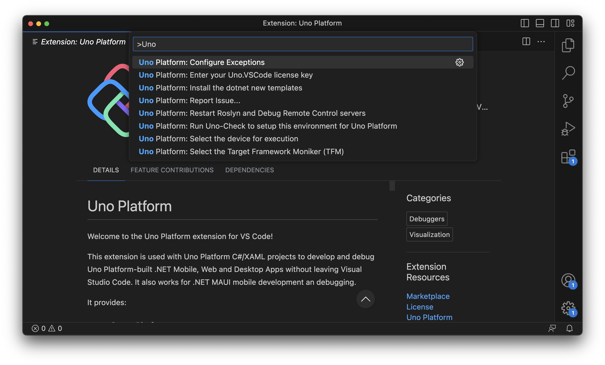

# Visual Studio Code Extension

To get started on using VS Code, [head over to our guides](xref:Uno.GetStarted.vscode).

In this page, you'll find other topics about VS Code support, such as code snippets or how to upgrade an existing app to use VS Code.

## Explore other features

The Uno Platform extension provides additional features to help you develop your application.

You can explore them by pressing `F1` or `Ctrl-Shift-P` and typing `Uno Platform` to see the list of available commands.

## Using code snippets

### Adding a new Page

1. In the MyApp folder, create a new file named `Page2.xaml`
2. Type `page` then press the `tab` key to add the page markup
3. Adjust the name and namespaces as needed
4. In the MyApp folder, create a new file named `Page2.xaml.cs`
5. Type `page` then press the `tab` key to add the page code behind C#
6. Adjust the name and namespaces as needed

### Adding a new UserControl

1. In the MyApp folder, create a new file named `UserControl1.xaml`
2. Type `usercontrol` then press the `tab` key to add the page markup
3. Adjust the name and namespaces as needed
4. In the MyApp folder, create a new file named `UserControl1.xaml.cs`
5. Type `usercontrol` then press the `tab` key to add the page code behind C#
6. Adjust the name and namespaces as needed

### Adding a new ResourceDictionary

1. In the MyApp folder, create a new file named `ResourceDictionary1.xaml`
2. Type `resourcedict` then press the `tab` key to add the page markup

### Other snippets

- `rd` creates a new `RowDefinition`
- `cd` creates a new `ColumnDefinition`
- `tag` creates a new XAML tag
- `set` creates a new `Style` setter
- `ctag` creates a new `TextBlock` close XAML tag

## Updating an existing application to work with VS Code

An existing application needs additional changes to be debugged properly.

1. At the root of the workspace, create a folder named `.vscode`
2. Inside this folder, create a file named `launch.json` and copy the [contents of this file](https://github.com/unoplatform/uno.templates/blob/main/src/Uno.Templates/content/unoapp/.vscode/launch.json).
3. Replace all instances of `MyExtensionsApp._1` with your application's name in `launch.json`.
4. Inside this folder, create a file named `tasks.json` and copy the [contents of this file](https://github.com/unoplatform/uno.templates/blob/main/src/Uno.Templates/content/unoapp/.vscode/tasks.json).

## Advanced debugging

You can find [advanced Code debugging topic here](xref:uno.vscode.mobile.advanced.debugging).
